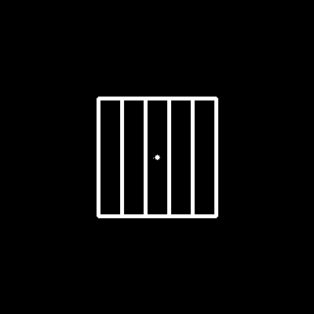
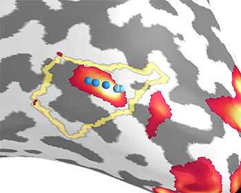
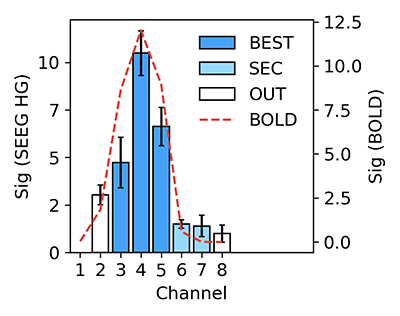
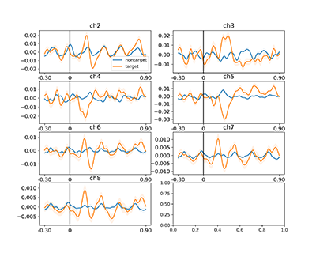
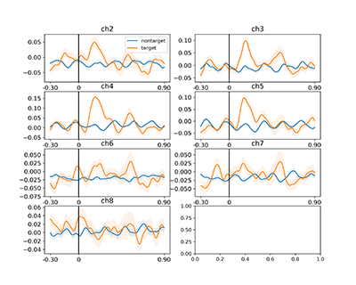

# MI-BCI
***MI-BCI*** means ***minimal invasive brain-computer interface (BCI)***. 
The repository is the sample code for the paper "Intracranial brain-computer interface 
spelling using localized visual motion response."

## Content

 - [Overview](#overview)
 - [System Requirements](#system-requirements)
 - [Installation Guide](#installation-guide)
 - [Tutorial](#tutorial)
 - [Example Dataset](#example-dataset)
 - [Support](#support)

## Overview
The code demonstrates the basic analysis pipeline of this paper, 
including fMRI localization and visualization, and SEEG processing.

### The fMRI localizer:


The activated MT area is obtained 
for choosing the optimal implantation spots.


### The BCI paradigm:


## System Requirements
This package required the following softwares to function properly:
* FreeSurfer 7.1.1
* Brainnetome atlas freesurfer
* python 3.6 or higher

## Installation Guide

### Python

**Note!!!** Installation using pip may face a problem of dependency package version conflict! 
The newest 'mayavi' version has a conflict with the newest 'vtk' package, 
so in requirement.txt we define the downloading versions to be 'vtk==8.1.2' and 'mayavi==4.6.2'. 
If you have installed a later version of mayavi or vtk before, please notice the version changing issue. 

```
 git clone https://github.com/HongLabTHU/MI-BCI.git
 cd MI-BCI
 pip install -r requirements.txt
```

### Brainnetome atlas
1. Download the atlas from the [official website](https://pan.cstcloud.cn/s/DQov5gaAR4s).
2. Copy the files `lh.BN_Atlas.gcs`, `rh.BN_Atlas.gcs`,
`BN_Atlas_subcortex.gca`, `BN_Atlas_246_LUT.txt`, 
to the FreeSurfer `SUBJECTS_DIR` folder.

## Tutorial

### MRI Preprocessing
To run this demo, you need to `recon` the surface using your local FreeSurfer:
```
cd ./MT-Localizer
./recon.sh
```
Wait until the recon-all command has finished.
Then, run `fsfast_mt_analysis.sh` to analyze fMRI
```
./fsfast_mt_analysis.sh -p ../data/fsfast --all
```
Then, perform parcellation based on Brainnetome atlas:
```
./BN_atlas_mapping.sh -s S1
```
### Electrode mark
Enter module `localizer-viz`
```
cd ..
cd ./localizer-viz
```
Project the marked electrodes to the pial or inflated surface.
```
python elecs_projection.py -s S1 --fsfast ../data/fsfast --hemi lh -eloc ../data/fsfast/AnatDir/S1_Electrode_locations.dat
# for detailed explaination of the input arguments, please type ``python elecs_projection.py --help ``
```

Now, we can visualize the result
```
python viz.py -s S1 --fsfast ../data/fsfast --hemi lh -eloc ../data/fsfast/AnatDir/S1_Electrode_locations.dat
```


### SEEG processing
```
cd ..
cd SEEG-proc
python seeg_processing.py
```



#### ERP waveforms:   


#### HG power:



## Example Dataset
For example data, please click [here](https://drive.google.com/file/d/1sdGg87FTTyS7iEvr9Kst60oAetsD4pAy/view?usp=sharing) 
to download. Unzip the file and put the two folders `SEEG` and `fsfast` into the data directory.

## Support
If you have a question or feedback, or find any problems, 
please feel free to open a git issue or pull request. Thanks!